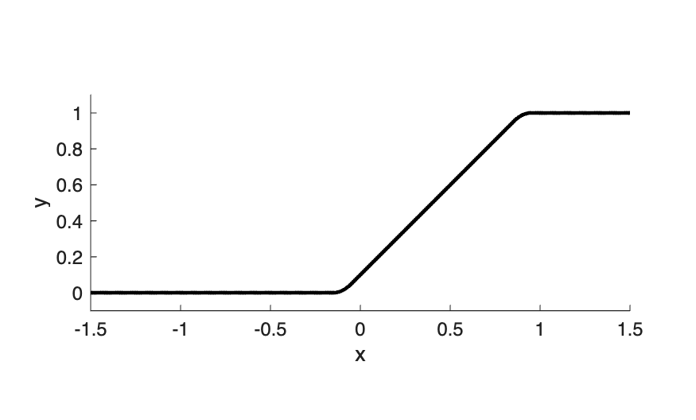

# SRNN Model Parameter Table

This document describes the equations, state variables, derived quantities, and parameters used to generate Figure 2.

## System Equations

$$
\frac{dx_i}{dt} = \frac{-x_i + u_i + \sum_{j=1}^{N} w_{ij}\, b_j r_{j}}{\tau_d}
$$

$$
r_i = \phi\left( x_i - a_{0_i} - c \sum_{k=1}^{K} a_{ik} \right)
$$

$$
\frac{da_{ik}}{dt} = \frac{-a_{ik} + r_i}{\tau_{a_k}}
$$

$$
\frac{db_i}{dt} = \frac{1-b_i}{\tau_{rec}} - \frac{b_i\, r_i}{\tau_{rel}}
$$

---

**Abbreviations:**
- **SRNN**: Stable Recurrent Nonlinear Network
- **SFA**: Spike frequency adaptation
- **STD**: Short-term synaptic depression

## Table 1: Model Parameters

| Symbol | Name | Value | Units | Description |
|--------|------|-------|-------|-------------|
| **State Variables** |||||
| $x_i$ | Membrane potential | $(-\infty, \infty)$ | arbitrary | Dendritic potential of neuron $i$ |
| $a_{ik}$ | Adaptation variable | $[0, 1]$ | — | SFA state for neuron $i$, timescale $k$ |
| $b_i$ | Synaptic resource | $[0, 1]$ | — | STD variable for neuron $i$ (available resources) |
| **Dependent Variables** |||||
| $r_i$ | Firing rate | $[0, 1]$ | — | Instantaneous firing rate, $r_i = \phi(\cdot)$ |
| $b_i r_i$ | Synaptic output | $[0, 1]$ | — | Effective synaptic output with STD |
| $u_i$ | External input | $[0, \infty)$ | arbitrary | External drive to neuron $i$ |
| **Connection Weight parameters** |||||
| $W$ | Connection matrix | — | — | $N \times N$ sparse weight matrix |
| $N$ | Network size | 300 | — | Total number of neurons |
| $f$ | Fraction excitatory | $\frac{1}{2}$ or (0.4–0.6) | — | Fraction of excitatory neurons, remainder are inhibitory; systematically varied from 0.4 to 0.6 to produce Figure 2G |
| $S$ | Sparsity mask | — | — | Binary mask, $S_{ij} \sim \text{Bernoulli}(\alpha)$ |
| $\alpha$ | Connection probability | $\frac{1}{3}$ | — | $\alpha = \text{indegree}/N = 100/300$ |
| $F$ | Default scaling factor | $\frac{1}{\sqrt{N\alpha(2-\alpha)}}$ | — | Scaling factor which yields $R=1$ if $\tilde{\mu}_E, \tilde{\mu}_I, \tilde{\sigma}_E, \text{ and } \tilde{\sigma}_I$ are equal (see derivation below). |
| $\tilde{\mu}_E$ | Mean excitatory weight | $3 F$ | — | Normalized mean of non-zero E weights |
| $\tilde{\mu}_I$ | Mean inhibitory weight | $-4 F$ | — | Normalized mean of non-zero I weights. If $f=\frac{1}{2}$, then inhibition exceeds excitation ($-4 F$ vs. $+3 F$), creating a negative global outlier eigenvalue|
| $\tilde{\sigma}_E$ | Std dev excitatory | $F$ | — | Normalized std dev of non-zero E weights |
| $\tilde{\sigma}_I$ | Std dev inhibitory | $F$ | — | Normalized std dev of non-zero I weights |
| **Time Constants** |||||
| $\tau_d$ | Dendritic time constant | 100 | ms | Membrane integration time constant |
| $\tau_{a_k}$ | SFA time constants | $[0.1, 1, 10]$ | s | Logspaced, $K=3$ timescales |
| $\tau_{rec}$ | STD recovery | 1 | s | Synaptic vesicle recovery time constant |
| $\tau_{rel}$ | STD release | $\frac{1}{2}$ | s | Synaptic vesicle release time constant |
| **Adaptation Strength** |||||
| $c_E$ | SFA coupling | $\frac{1}{12}$ | — | SFA strength per timescale |
| **Activation Function** |||||
| $\phi$ | Piecewise sigmoid | $(-\infty,\infty) \to [0,1]$ | — | Hard sigmoid with rounded corners (see definition below) |
| $q_\phi$ | Linear fraction | 0.9 | — | Fraction of the range [0, 1] that is linear (slope 1) |
| $a_0$ | Sigmoid center | 0.4 | — | Horizontal shift; $\phi(a_0) = \frac{1}{2}$ |
| **Stimulus Configuration** |||||
| $n_{steps}$ | Number of periods | 3 | — | Total number of no-stim and stim periods |
| $\rho_E$ | E input density | 0.15 | — | Fraction of E neurons receiving external input |
| $\rho_I$ | I input density | 0 | — | Fraction of I neurons receiving external input |
| $A$ | Input amplitude | $\frac{1}{2}$ | — | Amplitude scale for Gaussian random step input |
| **Simulation Settings** |||||
| $f_s$ | Sampling frequency | 400 | Hz | ODE solver sampling rate |
| $T$ | Simulation interval | $[-15, 45]$ | s | Start and end time |
| **ODE Integration** |||||
| — | Solver | RK45 | — | MATLAB ode45 (Dormand-Prince) |
| — | Relative tolerance | $10^{-9}$ | — | ODE solver RelTol |
| — | Absolute tolerance | $10^{-9}$ | — | ODE solver AbsTol |
| — | Maximum step | 2.5 | ms | ODE solver MaxStep ($1/f_s$) |
| **Lyapunov Settings** |||||
| — | LLE method | — | — | Benettin rescaling shadow trace method |
| $\Delta t_{lya}$ | Rescaling period | 20 | ms | Shadow trace rescaling interval |
| $d_0$ | Perturbation norm | $10^{-3}$ | — | Initial and rescaled perturbation magnitude |
| $f_{corner}$ | LLE filter corner | 0.25 | Hz | corner frequency for lowpass filter of local LLE for plotting, 4th order bidirectional Butterworth |

---

## Definition of the Activation Function $\phi(x)$

The activation function $\phi(x)$ is a **hard sigmoid with rounded corners**—a piecewise function composed of five regions that smoothly transitions between saturation at 0 and 1.

**Domain:** $(-\infty, \infty)$  
**Range:** $[0, 1]$

**Auxiliary quantities:**

Let the half-width of the linear segment be $q = \frac{q_\phi}{2}$, and define the scaling constant for the quadratic regions:

$$k = \frac{1}{2(1 - 2q)}$$

The four breakpoints dividing the five regions are:

$$x_1 = a_0 + q - 1, \quad x_2 = a_0 - q, \quad x_3 = a_0 + q, \quad x_4 = a_0 + 1 - q$$

**Piecewise definition:**

$$
\phi(x) = 
\begin{cases}
0 & \text{if } x < x_1 \quad \text{(left saturation)} \\[4pt]
k(x - x_1)^2 & \text{if } x_1 \le x < x_2 \quad \text{(left quadratic)} \\[4pt]
(x - a_0) + \tfrac{1}{2} & \text{if } x_2 \le x \le x_3 \quad \text{(linear segment)} \\[4pt]
1 - k(x - x_4)^2 & \text{if } x_3 < x \le x_4 \quad \text{(right quadratic)} \\[4pt]
1 & \text{if } x > x_4 \quad \text{(right saturation)}
\end{cases}
$$

**Parameter interpretation:**

- **$q_\phi \in [0, 1]$**: Controls the width of the central linear region. When $q_\phi = 1$, the function reduces to a standard hard sigmoid (pure piecewise linear with corners). When $q_\phi = 0$, the function becomes purely quadratic transitions with no linear segment.

- **$a_0$**: The horizontal center of the sigmoid. At $x = a_0$, the function outputs $\phi(a_0) = \frac{1}{2}$. This parameter shifts the entire function along the $x$-axis, allowing the resting point of the firing rate to be tuned.

> **Note:** The quadratic segments ensure $C^1$ continuity (smooth corners) at the transitions between the linear and saturated regions, avoiding the discontinuous derivatives of a standard hard sigmoid.

---

## Derivation of the Default Scaling Factor $F$

The scaling factor $F$ is derived from Harris (2023), Equations 16 and 18.

**Equation 16** — Sparse variance for population $k \in \{e, i\}$:

$$\sigma_{sk}^2 = \alpha(1-\alpha)\tilde{\mu}_k^2 + \alpha \tilde{\sigma}_k^2$$

**Equation 18** — Spectral radius:

$$\mathcal{R} = \sqrt{N[f \sigma_{se}^2 + (1-f)\sigma_{si}^2]}$$

**Derivation:** To find the scaling factor $F$ that yields a unit spectral radius ($\mathcal{R} = 1$) when all normalized parameters are equal, set $|\tilde{\mu}_E| = |\tilde{\mu}_I| = \tilde{\sigma}_E = \tilde{\sigma}_I = F$.

Substituting into Eq. 16:

$$\sigma_{se}^2 = \sigma_{si}^2 = \alpha(1-\alpha)F^2 + \alpha F^2 = F^2[\alpha - \alpha^2 + \alpha] = F^2 \cdot \alpha(2-\alpha)$$

Substituting into Eq. 18, noting that $f + (1-f) = 1$:

$$\mathcal{R} = \sqrt{N \cdot F^2 \cdot \alpha(2-\alpha)} = 1$$

Solving for $F$:

$$F = \frac{1}{\sqrt{N\alpha(2-\alpha)}}$$

---

> **Note on Zero Row Sum (ZRS):** Harris (2023) describes a Zero Row Sum condition (ZRS/SZRS) that controls "local" eigenvalue outliers escaping the spectral disc. In these simulations, we deliberately did not apply the ZRS condition in order to test whether adaptation mechanisms (SFA and STD) could fulfill a similar stabilizing role—effectively examining if adaptation can substitute for ZRS in constraining network dynamics.

## Table 2: Adaptation Conditions

The four conditions are defined by enabling/disabling SFA and STD via the number of timescales ($K = n_{a_E}$ in the equations):

| Condition | $n_{a_E}$ (K) | $n_{a_I}$ | $n_{b_E}$ | $n_{b_I}$ | Description |
|-----------|---------------|-----------|-----------|-----------|-------------|
| No Adaptation | 0 | 0 | 0 | 0 | Baseline |
| SFA Only | 3 | 0 | 0 | 0 | Spike-frequency adaptation enabled |
| STD Only | 0 | 0 | 1 | 0 | Short-term depression enabled |
| SFA + STD | 3 | 0 | 1 | 0 | Both mechanisms enabled |

**Effect on parameters:**

- When $n_{a_E} = 0$: No SFA variables $a_{ik}$; the $c_E \sum_k a_{ik}$ term is zero.
- When $n_{a_E} = 3$: Three SFA timescales with $\tau_{a_k} \in \{0.1, 1, 10\}$ s and coupling $c_E = \frac{1}{12}$.
- When $n_{b_E} = 0$: No STD variable $b_i$; synaptic output equals $r_i$ (equivalent to $b_i = 1$).
- When $n_{b_E} = 1$: STD enabled with $\tau_{rec} = 1$ s and $\tau_{rel} = \frac{1}{2}$ s.

Inhibitory neurons have no adaptation mechanisms ($n_{a_I} = n_{b_I} = 0$).

> **Implementation note:** When any of $n_{a_E}$, $n_{a_I}$, $n_{b_E}$, or $n_{b_I}$ is set to zero, the corresponding state variables ($a_{ik}$ or $b_i$) are excluded from the system state vector and the Jacobian matrix. This prevents spurious zero eigenvalues that would otherwise arise from including disabled adaptation dynamics.
